# 01 - Module Architecture Specification

> Linkmap Module Boundary Reference for Contributors
> Last updated: 2026-02-20

---

## 1. Module Overview

Linkmap is organized into 7 domain modules under `src/lib/`, supported by shared infrastructure (API errors, crypto, audit, supabase clients, i18n, queries, stores).

### 1.1 Module Summary Table

| Module | Directory | Files | Public API | Primary Consumers |
|--------|-----------|-------|------------|-------------------|
| **core** | `src/lib/api/`, `src/lib/crypto/`, `src/lib/audit.ts`, `src/lib/admin.ts`, `src/lib/quota.ts`, `src/lib/supabase/`, `src/lib/queries/keys.ts`, `src/lib/i18n/`, `src/lib/utils.ts`, `src/lib/validations/` | ~25 | Error helpers, encrypt/decrypt, logAudit, isAdmin, getUserQuota, Supabase clients (3), queryKeys, t(), cn() | All API routes, all modules |
| **github** | `src/lib/github/` | 5 | GitHub API wrapper (20+ methods), safeDecryptToken, encryptSecretForGitHub, autoMapEnvVars, triggerAutoSync | API routes: github/*, oneclick/*, env/ |
| **env** | `src/lib/env/` | 1 | detectConflicts() | API routes: env/conflicts/ |
| **ai** | `src/lib/ai/` | 4 | callOpenAIStructured, callOpenAIWithTools, callOpenAIStream, callAiProvider, resolveOpenAIKey, checkGuardrails | API routes: ai/*, admin/ai-* |
| **oneclick** | `src/lib/queries/oneclick.ts` | 1 | useHomepageTemplates, useDeployToGitHubPages, useDeployStatus, useMyDeployments, useDeployFiles, useUpdateFile, useBatchApplyFiles, useDeleteDeployment | Oneclick page components |
| **health-check** | `src/lib/health-check/` | 12 | runHealthCheck(), getAdapter(), listAdapters() | API route: health-check/ |
| **connections** | `src/lib/connections/` | 1 | suggestAutoConnections() | API route: connections/auto/ |

### 1.2 Module Details

#### core (Foundation Layer)

The core module provides shared infrastructure that every other module depends on. It is **not** a single directory but a collection of foundational files:

| File | Exports | Purpose |
|------|---------|---------|
| `src/lib/api/errors.ts` | `apiError`, `unauthorizedError`, `notFoundError`, `validationError`, `serverError` | Standardized HTTP error responses. All API routes MUST use these instead of constructing error objects directly. |
| `src/lib/crypto/index.ts` | `encrypt`, `decrypt`, `maskValue` | AES-256-GCM encryption for environment variables and OAuth tokens. Server-side only. Key: 64 hex chars via `ENCRYPTION_KEY`. |
| `src/lib/audit.ts` | `logAudit`, `AuditAction` (54 action types) | Audit logging via admin Supabase client. Non-blocking, never breaks main flow. |
| `src/lib/admin.ts` | `isAdmin` | Admin check via service_role client (bypasses RLS). |
| `src/lib/quota.ts` | `getUserQuota`, `checkHomepageDeployQuota`, `checkProjectQuota` | Plan-based quota enforcement (free/pro tiers). |
| `src/lib/supabase/server.ts` | `createClient` (async) | Server-side Supabase client with cookie-based auth. Used in API routes and Server Components. |
| `src/lib/supabase/client.ts` | `createClient` (sync) | Browser-side Supabase client. Used in client components. |
| `src/lib/supabase/admin.ts` | `createAdminClient` | Service-role client. **Restricted to audit logs and admin operations only.** |
| `src/lib/supabase/session.ts` | `updateSession` | Middleware session refresh and route protection. |
| `src/lib/supabase/types.ts` | DB-specific type aliases | Supabase query result types. |
| `src/lib/queries/keys.ts` | `queryKeys` | TanStack Query key factory (13 domains, 40+ keys). Single source of truth for cache invalidation. |
| `src/lib/i18n/index.ts` | `t`, `getMessages`, `localeNames`, `Locale` | i18n: Korean-first with English support. Zustand `locale-store` drives UI language. |
| `src/lib/utils.ts` | `cn` | Tailwind CSS class merging utility (clsx + tailwind-merge). |
| `src/lib/hooks/use-streaming.ts` | `useStreaming` | Client-side SSE stream consumer hook (abort support, progressive text). |
| `src/lib/validations/*.ts` | 17 Zod schema files | Input validation schemas used by API routes. Always via `safeParse` (never `parse`). |

#### github (GitHub Integration)

Full GitHub REST API wrapper with OAuth token management:

| File | Exports | Purpose |
|------|---------|---------|
| `api.ts` | `listUserRepos`, `getRepo`, `listRepoSecrets`, `getRepoPublicKey`, `createOrUpdateSecret`, `deleteSecret`, `forkRepo`, `generateFromTemplate`, `enableGitHubPages`, `enableGitHubPagesWithActions`, `getGitHubPagesStatus`, `createRepo`, `createOrUpdateFileContent`, `listRepoContents`, `getFileContent`, `updateRepoSettings`, `pushFilesAtomically`, `triggerWorkflowDispatch`, `getLatestWorkflowRun`, `deleteRepo`, `GitHubApiError` | All GitHub REST API calls go through `githubFetch()`. Error handling via `GitHubApiError` class. |
| `token.ts` | `safeDecryptToken` | Decrypts OAuth tokens with fallback: marks account as 'expired' on decryption failure (key rotation scenario). |
| `nacl-encrypt.ts` | `encryptSecretForGitHub` | NaCl sealed-box encryption for GitHub Secrets API (tweetnacl). |
| `auto-map.ts` | `mapEnvVarToSecretName`, `autoMapEnvVars` | Maps Linkmap env var names to valid GitHub Secrets names with conflict detection. |
| `auto-sync.ts` | `triggerAutoSync` | Non-blocking push of env vars to GitHub Secrets when auto_sync_enabled repos exist. Depends on: crypto, api, nacl-encrypt, auto-map, audit. |

#### env (Environment Variable Intelligence)

| File | Exports | Purpose |
|------|---------|---------|
| `conflict-detector.ts` | `detectConflicts`, `ConflictType`, `ConflictSeverity`, `EnvConflict`, `EnvConflictEntry` | Cross-environment conflict detection: missing values, critical mismatches, config mismatches. Sorted by severity. |

#### ai (AI Features)

Five distinct AI features, each using a different OpenAI API technique:

| File | Exports | Purpose |
|------|---------|---------|
| `openai.ts` | `callOpenAIStructured<T>`, `callOpenAIWithTools`, `callOpenAIStream`, `ToolDefinition` | Three OpenAI calling modes: (1) Structured Output with JSON Schema, (2) Function Calling with tool loop, (3) SSE Streaming. |
| `resolve-key.ts` | `resolveOpenAIKey` | Resolves API key from `OPENAI_API_KEY` env var or DB `ai_providers` table (encrypted). |
| `providers.ts` | `callAiProvider`, `AiChatRequest`, `AiChatResponse` | Multi-provider dispatcher: OpenAI, Anthropic, Google Gemini. Used by admin AI playground. |
| `guardrails.ts` | `checkGuardrails`, `GuardrailResult` | Input safety checks: conversation turn limit, token limit, blocked words, denied topics. |

#### health-check (Service Health Monitoring)

Adapter pattern for checking external service health via their APIs:

| File | Exports | Purpose |
|------|---------|---------|
| `index.ts` | `runHealthCheck` | Entry point: decrypts env vars, runs adapter check, clears sensitive data from memory. |
| `types.ts` | `HealthCheckAdapter`, `HealthCheckResult`, `HealthCheckStatus` | Interface definitions for the adapter pattern. |
| `registry.ts` | `getAdapter`, `getOrCreateAdapter`, `listAdapters` | Adapter registry with 8 built-in adapters + generic fallback. |
| `adapters/*.ts` | 9 adapter files | openai, anthropic, stripe, supabase, clerk, resend, vercel, sentry, generic. |

#### connections (Service Connection Intelligence)

| File | Exports | Purpose |
|------|---------|---------|
| `auto-connect.ts` | `suggestAutoConnections` | Given a project's services and the global dependency graph, suggests connections that don't already exist. Prioritized by dependency type. |

---

## 2. API Route Mapping

All API routes follow the 5-step pattern: **Auth -> Zod safeParse -> Ownership check -> Business logic -> Audit log**.

### 2.1 Environment Variables (`/api/env/`)

| Path | Method | Auth | Zod Schema | Audit Action |
|------|--------|------|------------|--------------|
| `/api/env` | POST | User | `createEnvVarSchema` | `env_var.create` |
| `/api/env` | PUT | User | `updateEnvVarSchema` | `env_var.update` |
| `/api/env` | DELETE | User | id (query param) | `env_var.delete` |
| `/api/env/bulk` | POST | User | `bulkEnvVarSchema` | `env_var.bulk_create` |
| `/api/env/decrypt` | POST | User | id (body) | `env_var.decrypt` |
| `/api/env/download` | POST | User | project_id, environment | `env_var.download` |
| `/api/env/conflicts` | GET | User | project_id (query) | `env_var.conflict_scan` |
| `/api/env/conflicts/resolve` | POST | User | `resolveConflictSchema` | `env_var.conflict_resolve` |

### 2.2 Projects (`/api/projects/`)

| Path | Method | Auth | Zod Schema | Audit Action |
|------|--------|------|------------|--------------|
| `/api/projects` | GET | User | - | - |
| `/api/projects` | POST | User | `createProjectSchema` | `project.create` |
| `/api/projects/[id]` | GET | User | - | - |
| `/api/projects/[id]` | PUT | User | `updateProjectSchema` | `project.update` |
| `/api/projects/[id]` | DELETE | User | - | `project.delete` |
| `/api/projects/[id]/dashboard` | GET | User | - | - |
| `/api/projects/[id]/linked-accounts` | GET | User | - | - |
| `/api/projects/[id]/layer-override` | PUT | User | body validation | `layer_override.upsert` |

### 2.3 Connections (`/api/connections/`)

| Path | Method | Auth | Zod Schema | Audit Action |
|------|--------|------|------------|--------------|
| `/api/connections` | GET | User | project_id (query) | - |
| `/api/connections` | POST | User | `createConnectionSchema` | `connection.create` |
| `/api/connections/[id]` | PUT | User | `updateConnectionSchema` | `connection.update` |
| `/api/connections/[id]` | DELETE | User | - | `connection.delete` |
| `/api/connections/auto` | POST | User | project_id (body) | `connection.auto_create` |

### 2.4 GitHub (`/api/github/`)

| Path | Method | Auth | Zod Schema | Audit Action |
|------|--------|------|------------|--------------|
| `/api/github/repos` | GET | User | project_id (query) | - |
| `/api/github/repos/link` | POST | User | `linkRepoSchema` | `github.repo_link` |
| `/api/github/repos/link` | DELETE | User | - | `github.repo_unlink` |
| `/api/github/secrets` | GET | User | project_id, owner, repo (query) | - |
| `/api/github/secrets` | POST | User | `pushSecretsSchema` | `github.secrets_push` |

### 2.5 Service Accounts (`/api/service-accounts/`)

| Path | Method | Auth | Zod Schema | Audit Action |
|------|--------|------|------------|--------------|
| `/api/service-accounts` | POST | User | `connectApiKeySchema` | `service_account.connect_api_key` |
| `/api/service-accounts/[id]` | DELETE | User | - | `service_account.disconnect` |
| `/api/service-accounts/verify` | POST | User | `verifyAccountSchema` | `service_account.verify` |

### 2.6 OAuth (`/api/oauth/`)

| Path | Method | Auth | Zod Schema | Audit Action |
|------|--------|------|------------|--------------|
| `/api/oauth/[provider]/authorize` | GET | User | project_id, service_id, service_slug (query) | - |
| `/api/oauth/[provider]/callback` | GET | - (state token) | - | `service_account.connect_oauth` |
| `/api/account/connected-accounts` | GET | User | - | - |

### 2.7 Health Check (`/api/health-check/`)

| Path | Method | Auth | Zod Schema | Audit Action |
|------|--------|------|------------|--------------|
| `/api/health-check` | POST | User | `runHealthCheckSchema` | `service.health_check` |

### 2.8 OneClick Deploy (`/api/oneclick/`)

| Path | Method | Auth | Zod Schema | Audit Action |
|------|--------|------|------------|--------------|
| `/api/oneclick/templates` | GET | User | deploy_target (query) | - |
| `/api/oneclick/deploy-pages` | POST | User | `deployPagesRequestSchema` | `oneclick.deploy_pages` |
| `/api/oneclick/status` | GET | User | `statusQuerySchema` | - |
| `/api/oneclick/github-check` | GET | User | - | - |
| `/api/oneclick/oauth/authorize` | GET | User | - | - |
| `/api/oneclick/deployments` | GET | User | - | - |
| `/api/oneclick/deployments/[id]` | DELETE | User | - | `oneclick.deploy_delete` |
| `/api/oneclick/deployments/[id]/files` | GET | User | path (query) | - |
| `/api/oneclick/deployments/[id]/files` | PUT | User | `fileUpdateSchema` | `oneclick.file_edit` |
| `/api/oneclick/deployments/[id]/batch-update` | POST | User | files array | `oneclick.batch_update` |
| `/api/oneclick/ai-chat` | POST | User | messages (body) | - |

### 2.9 AI Features (`/api/ai/`)

| Path | Method | Auth | Zod Schema | Audit Action | OpenAI Technique |
|------|--------|------|------------|--------------|-----------------|
| `/api/ai/stack-recommend` | POST | User | `stackRecommendSchema` | `ai.stack_recommend` | Structured Output |
| `/api/ai/env-doctor` | POST | User | `envDoctorSchema` | `ai.env_doctor` | Function Calling |
| `/api/ai/map-narrate` | POST | User | body validation | `ai.map_narrate` | SSE Streaming |
| `/api/ai/compare-services` | POST | User | `compareServicesSchema` | `ai.compare_services` | Rich Context Chat |
| `/api/ai/command` | POST | User | `aiCommandSchema` | `ai.command` | Function Calling |

### 2.10 Admin (`/api/admin/`)

| Path | Method | Auth | Zod Schema | Audit Action |
|------|--------|------|------------|--------------|
| `/api/admin/ai-config` | GET/PUT | Admin | `updateGlobalConfigSchema` | `admin.ai_config_update` |
| `/api/admin/ai-personas` | GET/POST | Admin | `createPersonaSchema` | `admin.ai_persona_create` |
| `/api/admin/ai-personas/[id]` | PUT/DELETE | Admin | `updatePersonaSchema` | `admin.ai_persona_update`, `admin.ai_persona_delete` |
| `/api/admin/ai-providers` | GET/PUT | Admin | `updateProviderSchema` | `admin.ai_provider_update` |
| `/api/admin/ai-guardrails` | GET/PUT | Admin | `updateGuardrailsSchema` | `admin.ai_guardrails_update` |
| `/api/admin/ai-templates` | GET/POST | Admin | `createTemplateSchema` | `admin.ai_template_create` |
| `/api/admin/ai-templates/[id]` | PUT/DELETE | Admin | `updateTemplateSchema` | `admin.ai_template_update`, `admin.ai_template_delete` |
| `/api/admin/ai-usage` | GET | Admin | period (query) | - |
| `/api/admin/ai-playground` | POST | Admin | `playgroundSchema` | `admin.ai_playground_test` |
| `/api/admin/setup-templates` | POST | Admin | - | `admin.setup_templates` |

### 2.11 Other Routes

| Path | Method | Auth | Zod Schema | Audit Action |
|------|--------|------|------------|--------------|
| `/api/teams` | POST | User | body validation | - |
| `/api/teams/[id]/members` | POST/DELETE | User | body validation | `team_member.add`, `team_member.remove` |
| `/api/tokens` | GET/POST/DELETE | User | body validation | - |
| `/api/stripe/checkout` | POST | User | body validation | - |
| `/api/stripe/webhook` | POST | Stripe sig | - | - |
| `/api/seed` | POST | Admin | - | - |

---

## 3. Dependency Diagram

```mermaid
graph TD
    subgraph "Core (Foundation)"
        ERRORS["api/errors.ts"]
        CRYPTO["crypto/index.ts"]
        AUDIT["audit.ts"]
        ADMIN["admin.ts"]
        QUOTA["quota.ts"]
        SB_SERVER["supabase/server.ts"]
        SB_CLIENT["supabase/client.ts"]
        SB_ADMIN["supabase/admin.ts"]
        KEYS["queries/keys.ts"]
        I18N["i18n/index.ts"]
        UTILS["utils.ts"]
        VALIDATIONS["validations/*.ts"]
    end

    subgraph "github"
        GH_API["github/api.ts"]
        GH_TOKEN["github/token.ts"]
        GH_NACL["github/nacl-encrypt.ts"]
        GH_MAP["github/auto-map.ts"]
        GH_SYNC["github/auto-sync.ts"]
    end

    subgraph "env"
        CONFLICT["env/conflict-detector.ts"]
    end

    subgraph "ai"
        AI_OPENAI["ai/openai.ts"]
        AI_RESOLVE["ai/resolve-key.ts"]
        AI_PROV["ai/providers.ts"]
        AI_GUARD["ai/guardrails.ts"]
    end

    subgraph "health-check"
        HC_INDEX["health-check/index.ts"]
        HC_REG["health-check/registry.ts"]
        HC_ADAPT["health-check/adapters/*"]
    end

    subgraph "connections"
        CONN_AUTO["connections/auto-connect.ts"]
    end

    subgraph "Hooks & Queries (Client)"
        STREAMING["hooks/use-streaming.ts"]
        Q_ONECLICK["queries/oneclick.ts"]
        Q_PROJECTS["queries/projects.ts"]
        Q_ENV["queries/env-vars.ts"]
        Q_GITHUB["queries/github.ts"]
        Q_HEALTH["queries/health-checks.ts"]
        Q_CONN["queries/connections.ts"]
    end

    subgraph "Stores (Zustand)"
        S_UI["stores/ui-store.ts"]
        S_PROJECT["stores/project-store.ts"]
        S_LOCALE["stores/locale-store.ts"]
        S_DASH["stores/dashboard-store.ts"]
        S_MAP["stores/service-map-store.ts"]
    end

    %% Core dependencies
    AUDIT --> SB_ADMIN
    ADMIN --> SB_ADMIN
    QUOTA --> SB_SERVER

    %% GitHub dependencies
    GH_TOKEN --> CRYPTO
    GH_SYNC --> SB_ADMIN
    GH_SYNC --> CRYPTO
    GH_SYNC --> GH_API
    GH_SYNC --> GH_NACL
    GH_SYNC --> GH_MAP
    GH_SYNC --> AUDIT

    %% AI dependencies
    AI_RESOLVE --> SB_ADMIN
    AI_RESOLVE --> CRYPTO

    %% Health-check dependencies
    HC_INDEX --> CRYPTO
    HC_INDEX --> HC_REG
    HC_REG --> HC_ADAPT

    %% Query dependencies
    Q_ONECLICK --> KEYS
    Q_PROJECTS --> KEYS
    Q_ENV --> KEYS
    Q_GITHUB --> KEYS
    Q_HEALTH --> KEYS
    Q_CONN --> KEYS

    %% Store dependencies
    S_LOCALE --> I18N
```



### Text-Based Dependency Summary

```
API Route (any)
  |-- core/errors       (error responses)
  |-- core/supabase     (server client for auth + queries)
  |-- core/validations  (Zod safeParse)
  |-- core/audit        (logAudit)
  |-- core/crypto       (encrypt/decrypt)
  |
  |-- github/*          (GitHub API routes)
  |     |-- github/api          (REST wrapper)
  |     |-- github/token        (decrypt OAuth tokens)
  |     |-- github/nacl-encrypt (GitHub Secrets encryption)
  |     |-- github/auto-map     (env var name mapping)
  |     |-- github/auto-sync    (push to GitHub on env change)
  |           |-- core/crypto, core/audit, github/api, github/nacl, github/auto-map
  |
  |-- env/*             (conflict detection routes)
  |     |-- env/conflict-detector (cross-env analysis)
  |
  |-- ai/*              (AI feature routes)
  |     |-- ai/openai       (3 calling modes)
  |     |-- ai/resolve-key  (key from env or DB)
  |     |-- ai/providers    (multi-provider dispatch)
  |     |-- ai/guardrails   (safety checks)
  |
  |-- health-check/*    (health monitoring routes)
  |     |-- health-check/index    (entry point)
  |     |-- health-check/registry (adapter lookup)
  |     |-- health-check/adapters (8 built-in + generic)
  |
  |-- connections/*     (connection routes)
        |-- connections/auto-connect (suggestion engine)
```

---

## 4. Type Domain Classification

All types are currently in `src/types/index.ts` (638 lines). They naturally split into 8 domains:

### 4.1 Type Domains

| Domain | Types | Line Range | Description |
|--------|-------|------------|-------------|
| **core** | `ServiceCategory`, `ServiceDomain`, `DifficultyLevel`, `FreeTierQuality`, `VendorLockInRisk`, `DependencyType`, `ChangeType`, `ServiceStatus`, `Environment`, `HealthCheckStatus`, `TeamRole`, `EasyCategory`, `Profile` | L1-90 | Shared enums and foundational types |
| **service** | `Service`, `EnvVarTemplate`, `ServiceDomainRecord`, `ServiceSubcategory`, `ServiceDependency`, `ServiceGuide`, `SetupStep`, `CommonPitfall`, `IntegrationTip`, `LocalizedText`, `ServiceComparison`, `ComparisonCriterion`, `ServiceCostTier`, `CostFeature`, `ServiceChangelog` | L235-454 | Service catalog and metadata |
| **project** | `Project`, `ProjectService`, `ProjectTemplate`, `ProjectWithServices`, `ChecklistItem`, `UserChecklistProgress` | L224-301 | Project management types |
| **env** | `EnvironmentVariable`, `ConflictType`, `ConflictSeverity`, `EnvConflict`, `EnvConflictEntry` | L303-314, L634-638 | Environment variable types (re-exports from `lib/env`) |
| **ai** | `AiAssistantConfig`, `AiProviderSlug`, `ContentFilterLevel`, `TemplateCategory`, `AiPersona`, `AiProviderModel`, `AiProvider`, `AiGuardrails`, `AiPromptTemplate`, `AiUsageLog`, `AiUsageSummary` | L92-222 | AI configuration, personas, providers, guardrails |
| **connection** | `UserConnectionType`, `ConnectionStatus`, `UserConnection` | L63-80 | User-defined service connections |
| **service-account** | `ServiceAccountConnectionType`, `ServiceAccountStatus`, `ServiceAccount`, `LinkedAccount`, `LinkedResource`, `ServiceOAuthConfig`, `ApiKeyFieldConfig`, `ServiceConnectionConfig` | L467-574 | OAuth/API key accounts and linked resources |
| **dashboard** | `DashboardLayer`, `DashboardSubcategory`, `ServiceCardData`, `LayerData`, `DashboardMetrics`, `DashboardResponse`, `HealthCheck` | L456-632 | Dashboard view types |

---

## 5. Zustand Stores

Five client-side stores manage UI and session state:

| Store | File | State | Persistence |
|-------|------|-------|-------------|
| `useUIStore` | `src/stores/ui-store.ts` | `sidebarOpen`, `commandOpen`, `aiCommandMode` | None (resets on page load) |
| `useProjectStore` | `src/stores/project-store.ts` | `activeProjectId` | None |
| `useLocaleStore` | `src/stores/locale-store.ts` | `locale` (`'ko'` / `'en'`) | `localStorage` via `zustand/persist` |
| `useDashboardStore` | `src/stores/dashboard-store.ts` | `activeTab`, `expandedCardId`, `showConnections`, `selectedConnectionId` | None |
| `useServiceMapStore` | `src/stores/service-map-store.ts` | `catalogSidebarOpen`, `viewMode`, `focusedNodeId`, `collapsedGroups`, `contextMenu`, `expandedNodeId`, `bottomPanelOpen` | None |

---

## 6. TanStack Query Key Domains

The `queryKeys` factory in `src/lib/queries/keys.ts` defines cache keys for 13 data domains:

| Domain | Key Pattern | Used By |
|--------|-------------|---------|
| `projects` | `['projects']`, `['projects', id]` | Dashboard, project pages |
| `services` | `['services', 'project', projectId]` | Project service list |
| `envVars` | `['env-vars', 'project', projectId]`, `['env-vars', 'stats', ...]`, `['env-vars', 'conflicts', ...]` | Env var table, conflict page |
| `catalog` | `['catalog']` | Service catalog browser |
| `connections` | `['connections', 'project', projectId]` | Connection management |
| `dependencies` | `['dependencies']` | Global dependency graph |
| `auditLogs` | `['audit-logs', 'project', projectId]` | Audit log viewer |
| `healthChecks` | `['health-checks', serviceId]`, `['health-checks', 'latest', projectId]` | Health dashboard |
| `serviceAccounts` | `['service-accounts', 'project', projectId]` | Account management |
| `github` | `['github', 'repos', ...]`, `['github', 'linked-repos', ...]`, `['github', 'secrets', ...]` | GitHub integration panel |
| `linkedAccounts` | `['linked-accounts', 'project', projectId, ...]` | Linked account list |
| `oneclick` | `['oneclick', 'templates']`, `['oneclick', 'status', deployId]`, `['oneclick', 'deployments']`, `['oneclick', 'files', ...]` | OneClick deploy flow |
| `ai` / `aiConfig` | `['ai', 'stack-recommend']`, `['ai', 'env-doctor', ...]`, `['ai-config', 'global']`, `['ai-config', 'personas']`, ... | AI features, admin AI config |

---

## 7. Validation Schemas

All Zod schemas are in `src/lib/validations/` (17 files):

| File | Schemas | Used By |
|------|---------|---------|
| `env.ts` | `createEnvVarSchema`, `updateEnvVarSchema` | `/api/env` |
| `env-bulk.ts` | `bulkEnvVarSchema` | `/api/env/bulk` |
| `env-conflicts.ts` | `resolveConflictSchema` | `/api/env/conflicts/resolve` |
| `project.ts` | `createProjectSchema`, `updateProjectSchema` | `/api/projects` |
| `connection.ts` | `createConnectionSchema`, `updateConnectionSchema` | `/api/connections` |
| `github.ts` | `linkRepoSchema`, `pushSecretsSchema`, `syncConfigSchema` | `/api/github/*` |
| `health-check.ts` | `runHealthCheckSchema` | `/api/health-check` |
| `service-account.ts` | `connectApiKeySchema`, `initiateOAuthSchema`, `verifyAccountSchema` | `/api/service-accounts/*` |
| `oneclick.ts` | `statusQuerySchema`, `deployPagesRequestSchema`, `fileUpdateSchema` | `/api/oneclick/*` |
| `ai-config.ts` | `createPersonaSchema`, `updatePersonaSchema`, `updateProviderSchema`, `updateGuardrailsSchema`, `createTemplateSchema`, `updateTemplateSchema`, `updateGlobalConfigSchema`, `playgroundSchema` | `/api/admin/ai-*` |
| `ai-stack.ts` | `stackRecommendSchema` | `/api/ai/stack-recommend` |
| `ai-env.ts` | `envDoctorSchema` | `/api/ai/env-doctor` |
| `ai-compare.ts` | `compareServicesSchema` | `/api/ai/compare-services` |
| `ai-command.ts` | `aiCommandSchema` | `/api/ai/command` |

---

## 8. Data Files

Static seed data and template content in `src/data/` (20 files):

| File | Purpose |
|------|---------|
| `services.ts`, `services-v2.ts` | Service catalog seed data |
| `dependencies.ts` | Service dependency graph |
| `domains.ts` | Service domain definitions |
| `subcategories.ts` | Service subcategory definitions |
| `comparisons.ts` | Service comparison matrices |
| `cost-tiers.ts` | Service pricing tier data |
| `service-connections.ts` | Predefined service connection patterns |
| `service-guides.ts` | Setup guides and code examples |
| `templates.ts` | Project template definitions |
| `presets.ts` | Service preset combinations |
| `flow-presets.ts` | React Flow layout presets |
| `mock-connections.ts` | Mock connection data for demos |
| `homepage-templates.ts` | OneClick homepage template registry |
| `homepage-template-content.ts` | Template HTML/CSS content |
| `template-sample-content.ts` | Sample content for templates |
| `dev-showcase-template.ts` | Developer portfolio template |
| `personal-brand-template.ts` | Personal brand template |
| `freelancer-page-template.ts` | Freelancer page template |
| `small-biz-template.ts` | Small business template |

---

## 9. Module Boundary Rules

These rules help contributors understand where new code should live:

1. **New API endpoint?** Create route file under `src/app/api/`. Use core error helpers, Zod validation from `src/lib/validations/`, and audit logging.

2. **New external service integration?** Add to `src/lib/github/` (if GitHub-related) or create a new module directory under `src/lib/`. Register health-check adapter if applicable.

3. **New AI feature?** Add API route under `src/app/api/ai/`, Zod schema under `src/lib/validations/ai-*.ts`, and use `resolveOpenAIKey()` + one of the three `callOpenAI*` helpers.

4. **New client-side data fetching?** Add TanStack Query hook to appropriate file in `src/lib/queries/`, register key in `src/lib/queries/keys.ts`.

5. **New UI state?** Use existing Zustand stores first. Only create a new store if the state domain is genuinely orthogonal to existing stores.

6. **New Supabase query?** Use `createClient()` from `src/lib/supabase/server.ts`. Never use `createAdminClient()` for normal CRUD (audit logs only).

7. **New type?** Add to `src/types/index.ts` in the appropriate domain section. Follow existing naming conventions.
